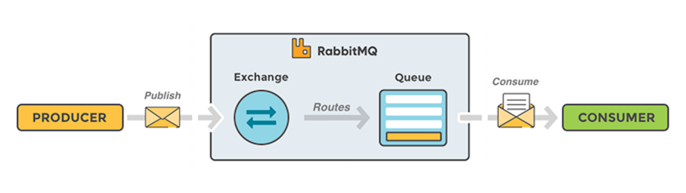

# RabbitMQ 範例

## 環境
- .Net Core 6.0
- RabbitMQ Client 7.0.0

## 安裝 RabbitMQ
- [RabbitMQ 官網](https://www.rabbitmq.com/download.html)
- [RabbitMQ 安裝教學](https://www.rabbitmq.com/docs/download)
- [RabbitMQ 管理介面](http://localhost:15672/)

## 安裝 RabbitMQ Client
- [NuGet](https://www.nuget.org/packages/RabbitMQ.Client/)

 `Install-Package RabbitMQ.Client -Version 7.0.0`

## 說明

- **Producer** 發送訊息到 **Exchange**
- **Exchange** 會根據 **Routing Key** 將訊息轉發到 **Queue**
- **Consumer** 從 **Queue** 取得訊息

## 範例
- [Producer](RabbitMQ.Producer)
- [Consumer](RabbitMQ.Consumer)
